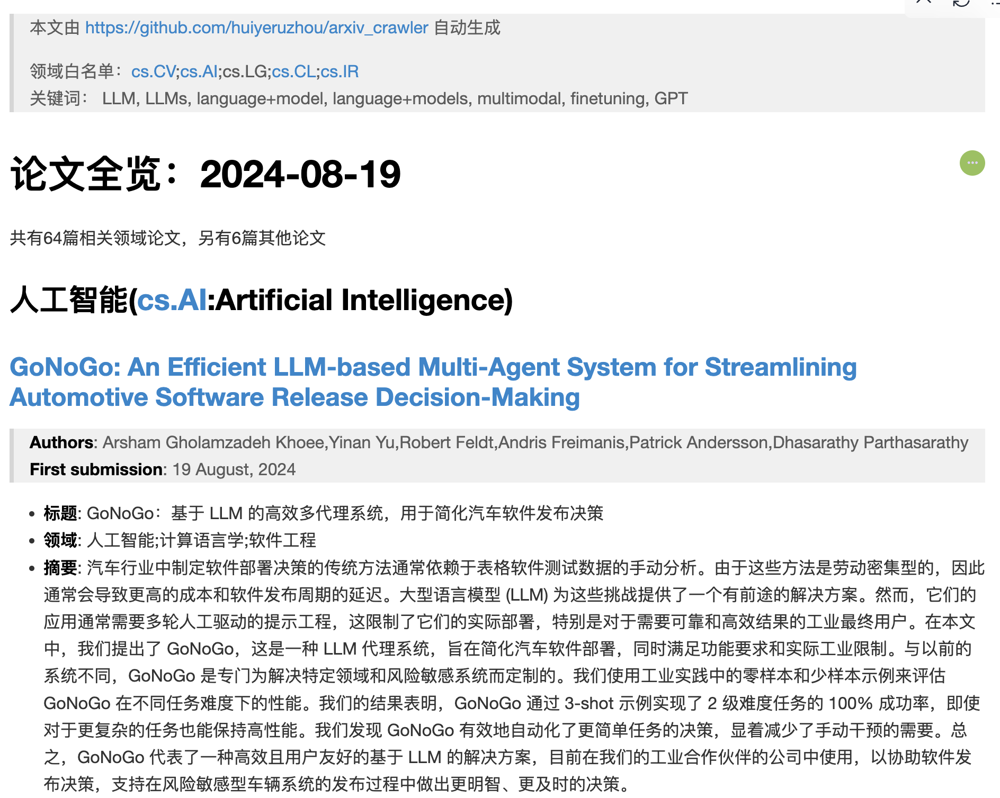

# ARXIV_CRAWLER

这是一个高效，快捷的arXiv论文爬虫，它可以将指定时间范围，指定主题，包含指定关键词的论文信息爬取到本地，并且将其中的标题和摘要翻译成中文。

通过进行异步网络请求，这个爬虫能够在两分钟之内爬取并翻译2000篇文章的标题和摘要信息，并且将其输出为精美的markdown文件

下列示意中，系统用4s爬取并翻译了2024年8月19日的全部63篇文章，并根据其领域过滤了其中的7篇。并将结果输出到`output_llms/2024-08-19.md`中。


markdown示意：


还可以配合飞书进行使用，实现方便的阅读和筛选，详情见[配合飞书的进阶用法](#配合飞书的进阶用法)


## 基本用法：爬取论文为markdown

1. 克隆本仓库到本地

```bash
git clone https://github.com/huiyeruzhou/arxiv_crawler.git
```

2. 安装依赖

```bash
pip install BeautifulSoup4
pip install rich
pip install aiohttp
pip install requests
```

3. 运行

```bash
python arxiv_crawler.py
```

这代码会将最近**一天**内大模型相关的论文信息爬取到本地，注意category白名单并不起作用，因为还没有设置黑名单。要广泛的爬取论文，可以添加不感兴趣的category到黑名单中，并用白名单进行豁免。

4. 用法说明

- 要修改爬取的时间范围，领域，关键字，请参考`arxiv_crawler.py`中`ArxivScraper`类的注释：
  一个文件被爬取到的条件是：首次提交时间在`date_from`和`date_until`之间，并且包含至少一个关键词。
  一个文章被详细展示（不被过滤）的条件是：至少有一个领域在白名单中，并且没有任何一个领域在黑名单中。
  - Args:
    - date_from (str): 开始日期
    - date_until (str): 结束日期
    - category_blacklist (list, optional): 黑名单. Defaults to [].
    - category_whitelist (list, optional): 白名单. Defaults to ["cs.CV", "cs.AI", "cs.LG", "cs.CL"]. 
    - optional_keywords (list, optional): 关键词, 各词之间关系为OR, 在标题/摘要中至少要出现一个关键词才会被爬取.
                                        Defaults to ["LLM", "language model", "multimodal", "finetuning", "GPT"].

   
- 如果你不需要翻译，只需要注释掉
```py
asyncio.run(scraper.translate())
```

- 输出文件名是根据日期生成的，可以使用`output`方法的`filename_format`参数修改日期格式，默认为`%Y-%m-%d`即形如`2024-08-08.md`。
```py
scraper.output(filename_format='%Y-%m-%d')
```

- 如果你希望将一条元信息添加到输出文件中，可以使用`output`方法的`meta`参数。
```py
scraper.output(meta=True)
```

元信息形如：
> 本文由 [https://github.com/huiyeruzhou/arxiv_crawler](https://github.com/huiyeruzhou/arxiv_crawler) 自动生成
>
> 领域白名单: cs.CV;cs.AI;cs.LG;cs.CL;cs.IR
> 关键词： LLM, LLMs, language+model, language+models, multimodal, finetuning, GPT

## 结果示例

假设爬取了七天的论文，那么结果可能形如：
```bash
output_llm
├── 2024-08-08.md
├── 2024-08-09.md
├── 2024-08-10.md
├── 2024-08-11.md
├── 2024-08-12.md
├── 2024-08-13.md
└── 2024-08-14.md
```

其中被保留的内容形如：

```md
# 论文全览：2024-08-16

共有57篇相关领域论文，另有6篇其他论文

## 人工智能(cs.AI:Artificial Intelligence)

### [Fine-tuningLLMsfor Autonomous Spacecraft Control: A Case Study Using Kerbal Space Program](https://arxiv.org/abs/2408.08676)
> **Authors**: Alejandro Carrasco,Victor Rodriguez-Fernandez,Richard Linares
> **First submission**: 16 August, 2024
- **标题**: 用于自主航天器控制的微调LLM：使用坎巴拉太空计划的案例研究
- **领域**: 人工智能;天体物理学仪器和方法
- **摘要**: 最近出现的趋势是使用大型语言模型（LLM）作为自主代理，根据用户文本提示的内容采取行动。本研究探索使用微调大型语言模型 (LLM) 进行自主航天器控制，并使用坎巴拉太空计划微分游戏套件 (KSPDG) 作为测试环境。由于模拟能力和数据不足，传统的强化学习（RL）方法在该领域面临局限性。通过利用 LLM，特别是 GPT-3.5 和 LLaMA 等微调模型，我们演示了这些模型如何使用基于语言的输入和输出有效地控制航天器。我们的方法将实时任务遥测集成到LLM处理的文本提示中，然后通过代理生成控制操作。结果引发了一场关于法学硕士在空间操作方面的潜力的讨论，超出了其名义上用于文本相关任务的范围。未来的工作旨在将这种方法扩展到其他空间控制任务，并评估不同法学硕士系列的表现。该代码可通过以下 URL 获取：\texttt{https://github.com/ARCLab-MIT/kspdg}。

...(Some other content)


```


然后是被过滤掉的内容，会显示它被过滤的原因（命中了哪个黑名单领域/所有领域都不在白名单当中）

```md
- [Vulnerability Handling of AI-Generated Code -- Existing Solutions and Open Challenges](https://arxiv.org/abs/2408.08549)
  - **标题**: 人工智能生成代码的漏洞处理——现有解决方案和开放挑战
  - **Filtered Reason**: cat:none of ['cs.SE'] in whitelist
```

## 配合飞书的进阶用法

得益于飞书文档提供的[多维表格](https://www.feishu.cn/hc/zh-CN/category/6933474572494716956-%E5%A4%9A%E7%BB%B4%E8%A1%A8%E6%A0%BC)功能，我们可以将论文信息转换为看板视图，以获得极尽丝滑的体验：


文章的信息一览无余，我们还可以根据自己的兴趣对文章进行粗筛，然后阅读自己最感兴趣的文章，如此大大提升了我们的科研效率。

### 1.输出为csv

下面这段代码将不会输出markdown，而是输出一个csv文件。通过参数指定不输出表头，并且以制表符分隔，我们可以直接复制这个csv的内容到飞书云文档中。

```py
from arxiv_crawler import ArxivScraper
import asyncio
from datetime import date, timedelta

today = date.today()
recent = today - timedelta(days=1)

date_from = recent.strftime("%Y-%m-%d")
data_until = today.strftime("%Y-%m-%d")

scraper = ArxivScraper(
    date_from=date_from,
    date_until=data_until,
)
asyncio.run(scraper.fetch_all())
asyncio.run(scraper.translate())
scraper.to_csv(csv_config=dict(delimiter="\t", header=False))
```

### 2.建立飞书多维表格

可以使用这个[模板](https://sx43gev8evy.feishu.cn/wiki/YLM1weiT3iaDNqkwL3NcnAO0nUb?from=from_copylink)

表格视图就是我们csv文件的内容，其中title作为索引，interest列是一个单选列，初始的interest只有两种，一种是chosen，另一种是filtered，分别对应于被保留和被过滤的文章。在阅读的过程中，可以根据自己的研究方向和兴趣进行筛选。categories是文章在arxiv上的领域tag，是一个多选列，飞书表格会自动将以逗号分隔的多选内容拆解开，实现自动识别。


切换到看板视图之后，就可以开始阅读和过滤文章了，这里我预设了5个等级的文章：
- CORE：表示scaling law这种经典文章，小同行的文章
- PEER：表示大同行的文章，相关领域的文章
- RELATED：表示相关领域的文章，或者相关内容的其他方法
- INTERESTING：和自己的科研领域方向较远，但比较有趣
- IRRELEVANT：比较trival的其他领域文章


### 3.复制csv内容

首先找到输出的文件，比如`output_llms/2024-08-19.csv`，记录一下它一共有多少行，全选并复制


接下来复制一份数据表，但是只复制其结构
<div style="display: flex; justify-content: space-between;">
    
    
</div>

在副本里插入和csv文件相等行数的内容。


然后`ctrl+a`全选再`ctrl+v`粘贴到表格中即可！

接下来切换到看板视图开始阅读论文吧！

## 相关技术

要爬取arxiv，可用的方法至少有三种。

1. 使用arxiv API。通过pyarxiv库，可以轻松地使用arxiv API来获取论文信息，并且可以精确的指定subcategory。但是这种方式无法通过时间范围进行筛选。
2. 使用arxiv的OAI-PMH数据。arxivscraper库使用这种方式进行爬取，但它返回的xml十分巨大，并且其时间是最后一次更新元数据的时间，而非初始提交时间。由于[一些特性](https://info.arxiv.org/help/oa/index.html)，甚至当作者完全没有更新过论文时，也会返回该论文。这会让我们看到很多过时的文章。
3. 基于arxiv网页。可选择的网页有许多，arxiv的网页格式非常简单。为了提供精确的时间范围，我选择使用[https://arxiv.org/search/advanced](https://arxiv.org/search/advanced)，此外爬取[https://arxiv.org/list/cs/recent](https://arxiv.org/list/cs/recent)是一个不错的方式。

要进行google翻译，关键是要计算出正确的token，参考了[zotero翻译插件](https://github.com/windingwind/zotero-pdf-translate/blob/main/src/modules/services/google.ts)的代码。
   